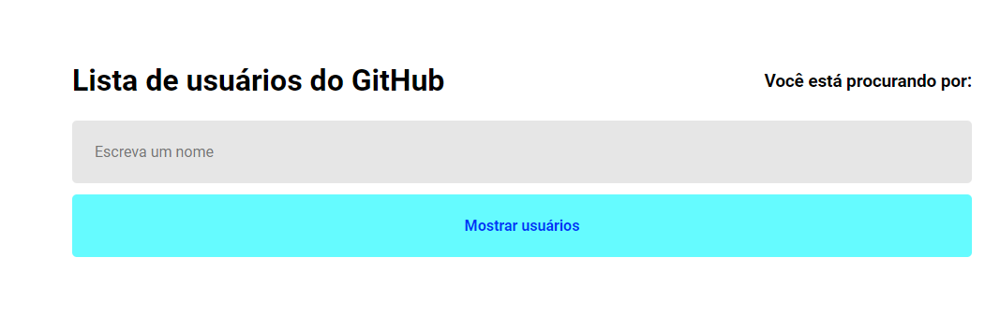
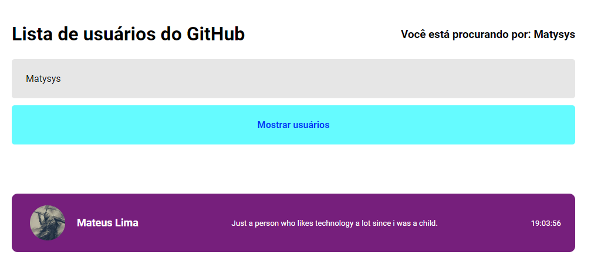
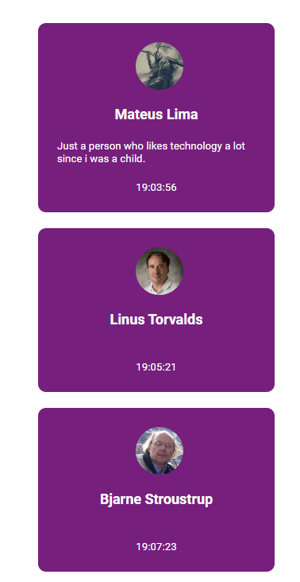
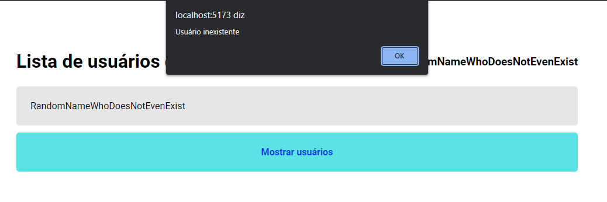

# Interface simples para pegar usuários do GitHub

Esse é um projeto pessoal que existe por motivos de estudo, isso é, para aprender o consumo de APIs RESTful.

O projeto tem uma caixa de texto da qual você coloca o nome de usuário existente no GitHub e depois clica no botão abaixo, assim algumas informações básicas do usuário vão ser geradas como:
* Nome pessoal
* Biografia
* Foto de perfil

# Como testar o projeto?

Crie uma pasta com o nome da sua escolha e inicie o Node.js dentro do diretório. Use os seguintes comandos abaixo:

Comando para baixar as dependências necessárias.
```
npm install
```
Comando para iniciar o projeto em localhost.
```
npm run dev
```

Também há um teste simples do _**Hook**_ useState para mostrar o nome digitado em tempo real na tela superior direita.

### Tela Inicial


### Usuário encontrado


### Mais usuários na lista


### Interface Mobile


### Usuário não existe

